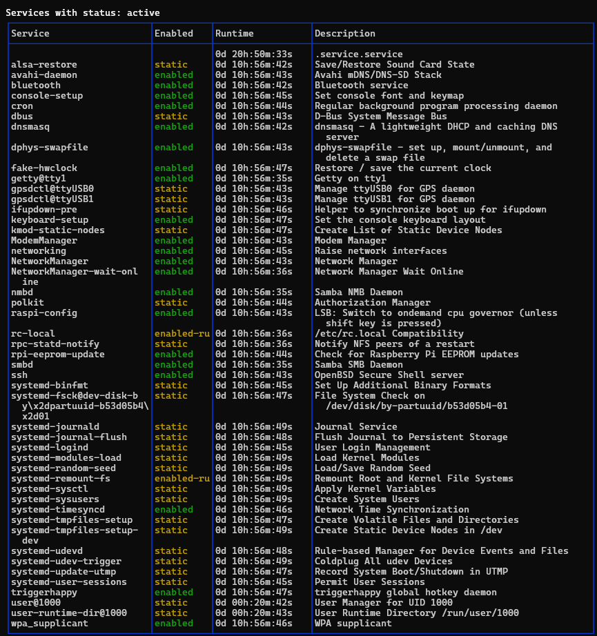

# Service Listing Script

This Bash script provides a colorful and informative display of system services on a Linux system, particularly focused on systems using systemd.

## Features

- List active, inactive, or all system services
- Display service status, runtime, and description
- Color-coded output for better readability
- Command-line arguments for flexible usage

## Usage

```bash
sudo ./list_services.sh [OPTION]
```

Options:
- `--all`: Show all services (both active and inactive)
- `--active`: Show only active services (default)
- `--inactive`: Show only inactive services
- `--help`: Display help message and exit

## Requirements

- Bash shell
- systemd-based Linux distribution
- Root privileges (sudo)

## Installation

1. Clone this repository:
   ```
   git clone https://github.com/yourusername/service-listing-script.git
   ```
2. Navigate to the project directory:
   ```
   cd service-listing-script
   ```
3. Make the script executable:
   ```
   chmod +x list_services.sh
   ```

## Example

To list all active services:

```bash
sudo ./list_services.sh --active
```

## Sample Output

Below is a sample of what the output might look like. Note that actual colors will be displayed in the terminal.




In the actual terminal output:
- The table borders will be in blue
- Service names, runtimes, and descriptions will be in white
- The "Enabled" status will be in green for "enabled" and yellow for other statuses

## Contributing

Contributions are welcome! Please feel free to submit a Pull Request.

## License

This project is licensed under the MIT License - see the [LICENSE](LICENSE) file for details.
